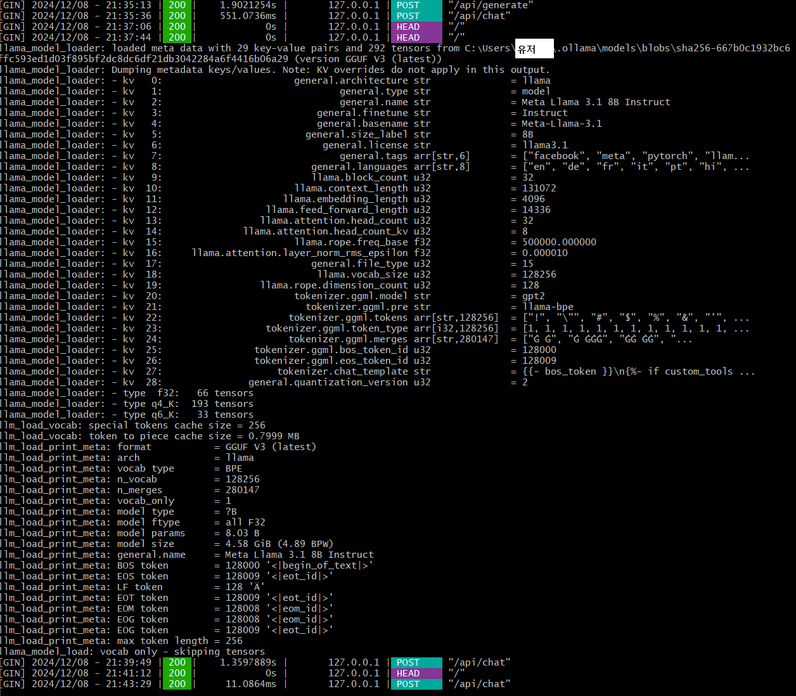

# AWS EC2를 활용한 Ollama 기반 Llama3.1 Chatbot 구축

## 프로젝트 개요
이 프로젝트는 AWS EC2와 Ollama를 사용하여 Llama3.1 모델 기반 챗봇을 실행하고 외부에서 API를 통해 질문/응답 기능을 제공하는 방법을 다룹니다.

---

## 1. AWS EC2 인스턴스 생성 및 설정

### 1.1 인스턴스 생성
- **OS**: Ubuntu 22.04
- **타입**: t2.micro (Free Tier)
- **포트 설정**: 
  - SSH(22번), HTTP(80번), Custom TCP Rule(11434번) 허용
  - Source: 0.0.0.0/0

### 1.2 SSH 키 생성 및 접속
```bash
# SSH 키 생성 (로컬에서 실행)
ssh-keygen -t rsa -b 4096 -C "your_email@example.com"

# EC2 접속 (AWS 퍼블릭 IP 사용)
ssh -i "path_to_key/your_key.pem" ubuntu@<EC2-퍼블릭-IP>
```

---

## 2. Ollama 설치 및 모델 준비

### 2.1 Ollama 설치
```bash
# Ollama 설치
curl -sSfL https://ollama.com/download | sh

# Ollama 버전 확인
ollama --version
```

### 2.2 Llama3.1 모델 다운로드
```bash
# 모델 다운로드
ollama pull llama3.1
```

---

## 3. 로컬 테스트

### 3.1 Ollama 서버 실행
```bash
ollama serve
```

### 3.2 API 테스트
PowerShell을 사용하여 다음 명령을 실행합니다.
```powershell
curl -X POST http://127.0.0.1:11434/api/chat `
-H "Content-Type: application/json" `
-d '{"model": "llama3.1", "prompt": "What is AI?"}'
```

응답 예시:
```json
{
    "response": "AI, or artificial intelligence, refers to the simulation of human intelligence in machines..."
}
```

---


## 4. AWS EC2와의 연결

### 4.1 Ollama Docker 이미지 실행
```bash
docker run -p 11434:11434 ollama
```

### 4.2 EC2에서 연결 테스트
```bash
curl -X POST http://<로컬-서버-퍼블릭-IP>:11434/api/chat -H "Content-Type: application/json" -d '{"model": "llama3.1", "prompt": "What is AI?"}'
```

---

## 5. 결과 로그

Ollama 실행 후 결과 로그:


---

## 참고
- [Ollama 공식 문서](https://ollama.com)
- [AWS EC2 공식 문서](https://aws.amazon.com/ec2/)
